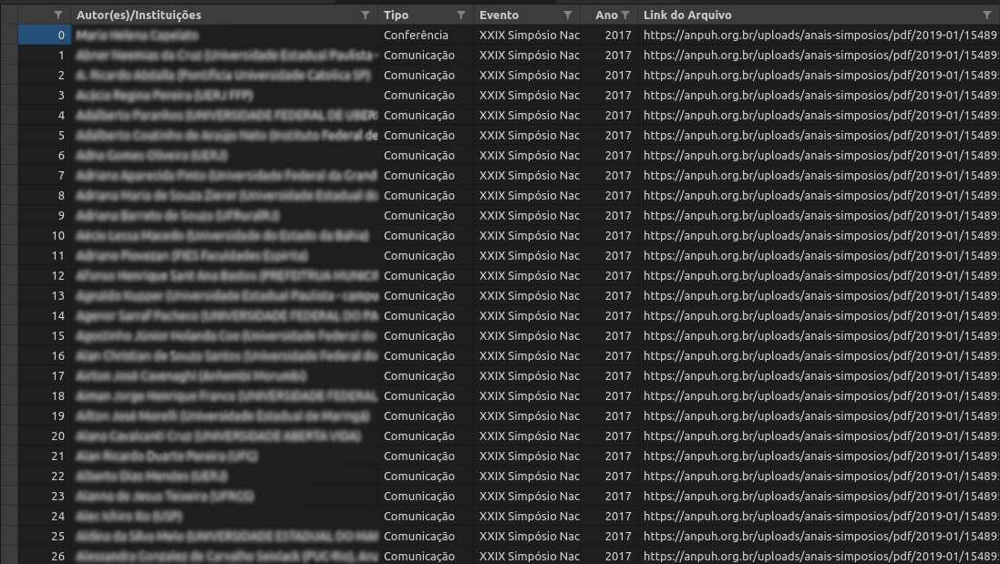

<p align="center"></p>

[](https://doi.org/10.1007/978-3-319-76207-4_15)
 [](https://www.python.org/) [](https://lbesson.mit-license.org/)

# Script Anais-Anpuh

*Projeto de script para web scraping da página de [Anais da Associação Nacional de História - Anpuh](https://anpuh.org.br/index.php/documentos/anais).
 Parte de projeto de História Digital desenvolvido no colegiado do curso de Licenciatura em História (CCLHM) da Unilab, campus dos Malês, sob coordenação do professor [Eric Brasil](https://ericbrasiln.github.io/) em parceria com o [Laboratório de Humanidades Digitais da Ufba](http://labhd.ufba.br/).*

*O Script Anais-Anpuh realiza a raspagem dos papers em pdf de todos os Simpósios Nacionais da Anpuh entre 1963 até 2017 (disponíveis atualmente na site).*
___

**A ferramenta foi desenvolvida apenas para pesquisas acadêmicas, sem fins lucrativos.**
___

Esse script foi pensado como uma ferramenta metodológica da pesquisa em humanidades
digitais. Sua criação é fruto das reflexões e experiências empíricas de historiadores e sociológos que têm enfrentado o [desafio de fazer ciências humanas no mundo digital](http://bibliotecadigital.fgv.br/ojs/index.php/reh/article/view/79933).
Defendemos a importância da apropriação, uso, desenvolvimento e aprimoramento de ferramentas digitais para as humanidades, assim como a urgência na sofisticação teórica, metodológica e epistemológica sobre as chamadas Humanidades Digitais.

É crescente o número de repositórios de fontes e dados on-line, assim como o acesso, busca, pesquisa e, muitas vezes, dependência de pesquisadores/as a eles.
Os Simpósios Nacionais da Anpuh, que acontecem bienalmente, têm reunido importantes reflexões sobre as mais variadas perspectivas historiográficas. Por conseguinte, os anais de cada evento constituem um importante repositório para pesquisas nos mais variados campos de estudo.
___

## Índice

- [Script Anais-Anpuh](#script-anais-anpuh)
  - [Índice](#índice)
  - [Instalação](#instalação)
    - [Python](#python)
      - [Bibliotecas e módulos](#bibliotecas-e-módulos)
  - [Resultados](#resultados)
  - [Licença](#licença)


## Instalação

Para executar o Script Anais-Anpuh, vc precisa acessar a pasta da ferramenta no [GitHub](https://github.com/ericbrasiln/Anais-Anpuh). Clone ou faça download do repositório e salve na pasta que deseja que os resultados e seus respectivos arquivos sejam armazenados. Antes de executar o script, é preciso preparar seu computador, como mostramos abaixo.

### Python

A ferramenta consiste num script escrito em [Python 3.8](https://www.python.org/). Esta é uma linguagem de programação que te permite trabalhar rapidamente e integrar diferentes sistemas com maior eficiência.
Para executar o arquivo .py é preciso instalar o Python3 em seu computador.

[Clique aqui](https://python.org.br/instalacao-windows/) para um tutorial de instalação do Python no Windows, [clique aqui](https://python.org.br/instalacao-linux/) para Linux e [clique aqui](https://python.org.br/instalacao-mac/)
para Mac.

Após a instalação, vc pode executar o arquivo .py direto do prompt de comando do Windows ou pelo terminal do Linux, ou utilizar as diversas [IDE](https://pt.wikipedia.org/wiki/Ambiente_de_desenvolvimento_integrado) disponíveis.

Exemplo de como executar utilizando o terminal do Linux, após instalar o Python3.8:

1. Acesse o diretório em que o arquivo .py está salvo:
   ```sh
   $ cd user/local
   ```
1. Instale as bibliotecas requeridas:
   ```sh
   $ pip3 install -r requirements.txt
   ```
1. Execute o arquivo usando Python3.8
   ```sh
   $ python3.8 script-anais-anpuh.py
   ```


#### Bibliotecas e módulos

- **urllib.requests**: módulo do Python que ajuda a acessar urls.
[Saiba mais.](https://docs.python.org/pt-br/3/library/urllib.request.htmll)
- **os**: módulo do Python que permite manipular funções do sistema operacional.
[Saiba mais.](https://docs.python.org/pt-br/3/library/os.html)
- **bs4**: [Beautiful Soup](https://www.crummy.com/software/BeautifulSoup/bs4/doc/) é uma biblioteca Python para extrair
 dados de arquivos HTML e XML.
- **re**: [Regular Expressions](https://docs.python.org/pt-br/3/library/re.html) é um módulo do Python para operar com expressões regulares.
- **pandas**: [Pandas](https://pandas.pydata.org/) é uma biblioteca escrita em Python para manipulação e análise de dados.
- - **wget**: [Wget](https://pypi.org/project/wget/) é uma biblioteca escrita em Python para realizar downloads. 

## Resultados

O script retorna para o usuário **todos os pdfs disponíveis em todas as páginas de todos os Simpósios Nacionais da Anpuh desde 1963 até 2017**. São criadas pastas com o número de cada evento para o armazenamento dos arquivos em PDF.

<p align="center"></p>

É importante notar que muitos papers não estão com pdf disponível no site, assim como nas edições mais antigas encontramos arquivos que contém vários papers num único PDF.

O script também gera um arquivo **CSV** (*comma-separated values*) contendo os seguintes valores para cada paper: Autor(es)/Instituições,Título, Tipo, Evento, Ano, Link do Arquivo. Esse arquivo pode ser aberto como uma planilha e trabalhado em banco de dados.



O script está funcionando perfeitamente. Qualquer alteração no site percebida pelos usuários ou sugestões de aprimoramento são bem vindas.

## Licença

MIT licensed

Copyright (C) 2020 [Eric Brasil](https://github.com/ericbrasiln), [Gabriel Andrade](https://github.com/gabrielsandrade), [LABHD-UFBA](http://labhd.ufba.br/)
